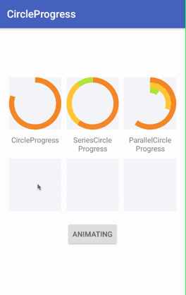

# CircleProgress

A Circle Progress View with normal, series and parallel styles.

# Quick Look



# Usage

### XML
```
<com.linsh.circleprogress.CircleProgress
    android:layout_width="100dp"
    android:layout_height="100dp"
    android:background="#113F51B5"
    app:progress="80"
    app:progressColor="@color/progressColor2"
    app:progressWidth="10dp"/>

<com.linsh.circleprogress.SeriesCircleProgress
    android:layout_width="100dp"
    android:layout_height="100dp"
    android:layout_marginLeft="10dp"
    android:layout_marginRight="10dp"
    android:background="#113F51B5"
    app:progress1="60"
    app:progress2="30"
    app:progress3="10"
    app:progressColor1="@color/progressColor2"
    app:progressColor2="@color/progressColor3"
    app:progressColor3="@color/progressColor4"
    app:progressWidth="10dp"/>

<com.linsh.circleprogress.ParallelCircleProgress
    android:layout_width="100dp"
    android:layout_height="100dp"
    android:background="#113F51B5"
    app:progress1="60"
    app:progress2="30"
    app:progress3="10"
    app:progressColor1="@color/progressColor2"
    app:progressColor2="@color/progressColor3"
    app:progressColor3="@color/progressColor4"
    app:progressWidth="10dp"/>

```

### Activity

* Needed

```
mCircleProgress.setProgressColor();
mCircleProgress.setProgressWidth();
mCircleProgress.setProgress();
mCircleProgress.setProgressWithAnimation();

mCircleProgress.setEmptyColor();
mCircleProgress.setStartAngle();
```

* unnecessary

```
mCircleProgress.setEmptyColor();
mCircleProgress.setStartAngle();
```